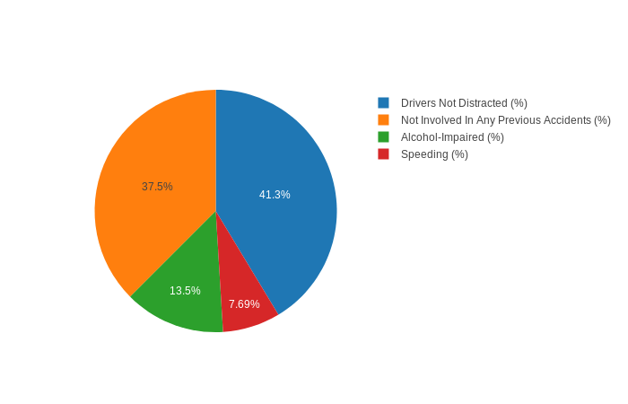

## Developers
Ashley Newsome 

## Contributions
https://github.com/AshleyN224/BH-Code

## Dependencies (potential subsection for program design)

#### Standard Built-In Libraries
- csv
- sys

#### Third Party Libraries 
- [Pandas](https://github.com/pandas-dev/pandas)
- [Plotly.py](https://github.com/plotly/plotly.py)
- [Pyfiglet](https://github.com/pwaller/pyfiglet)

## Support
For any help regarding issues, questions, or concerns, please feel free to ... 

---
---
# Introduction 
This program is a script that will give users an insight on fatal collisions in their state. They will be able to enter the state of their choice and the program will provide statistics and charts for that particular location.

The pseudo code will work as follows: 
- Call the program with US state.
- Fetch the data from the CSV file.
- Call Plotly.py API.
    - Charts and graphs are HTML output
- Display statistics to the screen or graph to the screen

---

## Motivation

---

## Program Description
Driving-Stats is a program that utilizes "an interactive, open-source, and browser-based graphing library" to display fatal collision data.

---

## Program Design

#### How the program works
Driver-Stats utilizes the module `plotly` to graph and display CSV and Pandas data. This is a sample output using Plotly:
 

Plotly is using a dataframe created from a CSV file to display data to the user.

Data for the CSV file was collected by FiveThirtyEight (or, 538) (https://github.com/fivethirtyeight/data)

---

#### The usage options of this program are as follows:

Get statistics of a state:
> `python driving_stats.py -stats`
>
> OR
>
> `python driving_stats.py -stats [state]`

Display the pie graph resprenting the statistics of a particular state:
> `python driving_stats.py -pie`
> 
> OR
> 
> `python driving_stats.py -pie [state]`

Display the bar graph representing the statistics of a particular state:
> `python driving_stats.py -bar`
>
> OR
> 
> `python driving_stats.py -bar [state]`

Enter command line interface of the program:
> `python driving_stats.py`
> 
Note: States that have more than one word should be put in quotes. Example:
> `python driving_stats.py -stats 'Los Angeles'`

--- 
`python driving_stats.py` will launch a command line interface version of Driving_Stats. The user can loop through the program multiple times using this method. The interface is as follows:
    
    > python driving_stats.py  

    What would you like to do?
    (1) Get stats
    (2) Get pie chart
    (3) Get bar chart
    (4) Exit program

---
### Authentication

`Plotly` handles authentication by using an API key and user name. All authentication is done at the beginning of `driving_stats.py` where the object `api` is instantiated and will be used for making authenticated API calls. `api` is imported to `geotweets.py` to make the `trends_places` function call.  Ordinarily the keys:

`api_key`,
`plotly.tools.set_credentials_file(username = [], api_key)`,
`plotly.tools.set_config_file(world_readable=True, sharing='public')`,

should not have have their values included in the code posted to GitHub, but for the purposes of this educational opportunity and demo they are left in for the demo.
Also, for enterprise purposes, `world_readable` would be set to `False` and `sharing` would be set to `private` for privacy and security.

---
